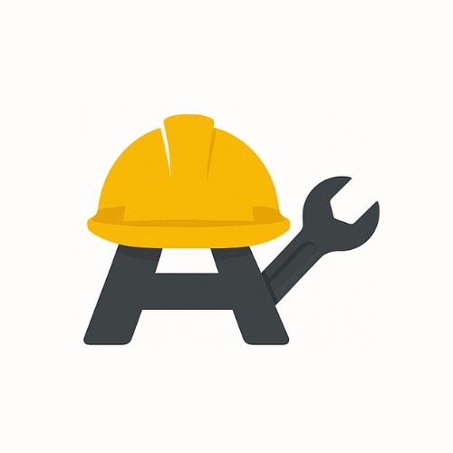

#  AlkileApp: Plataforma de Alquiler de Herramientas

## Descripción del Proyecto

AlkileApp es una plataforma web para el alquiler de herramientas que permite a los usuarios:
- Explorar y reservar herramientas disponibles
- Gestionar sus reservas
- Administrar categorías y proveedores (según su rol)

La aplicación está desarrollada con JavaScript vanilla (sin frameworks) siguiendo un patrón de diseño modular y orientado a objetos.

## Características Principales

### Roles de Usuario
- **Administrador (ADMIN):** Acceso completo a todas las funcionalidades
- **Proveedor (SUPPLIER):** Puede gestionar herramientas pero no proveedores
- **Cliente (CUSTOMER):** Puede reservar herramientas y ver sus reservas

### Módulos Principales
1. **Autenticación:** Login y gestión de sesiones
2. **Herramientas:** 
   - Catálogo de herramientas con filtros
   - CRUD completo de herramientas (según rol)
   - Subida de imágenes para herramientas
3. **Reservas:**
   - Creación de reservas con validación de fechas
   - Filtrado por estado (Pendiente, Confirmada, Cancelada, Completada)
   - Cancelación de reservas pendientes
4. **Categorías:** 
   - Gestión de categorías para organizar herramientas
5. **Proveedores:**
   - CRUD de proveedores (solo para administradores)

## Tecnologías Utilizadas

- **Frontend:**
  - JavaScript Vanilla (ES6+)
  - HTML5 y CSS3
  - Font Awesome para iconos
  - Fetch API para comunicación con el backend

- **Backend (API):**  
  El backend de este proyecto se encuentra en el repositorio:  
  [https://github.com/nilsoncarvajal67950/Proyecto_RentaHerramientas_CarvajalNilson_CorzoAyelmer_CarrascalJhosua](https://github.com/nilsoncarvajal67950/Proyecto_RentaHerramientas_CarvajalNilson_CorzoAyelmer_CarrascalJhosua)

## Estructura del Proyecto

```
src/
├── components/
│   ├── Auth/               # Componentes de autenticación
│   ├── Categories/         # Componentes para gestión de categorías
│   ├── Reservations/       # Componentes para reservas
│   ├── Suppliers/          # Componentes para proveedores
│   ├── Tools/              # Componentes para herramientas
│   ├── app.js             # Clase principal de la aplicación
│   └── Header.js          # Componente del encabezado
├── services/               # Servicios para comunicación con API
├── index.html             # Página principal
└── css/                   # Estilos CSS
```

## Instalación y Ejecución

1. Clonar el repositorio del frontend:
   ```bash
   git clone https://github.com/nilsoncarvajal67950/Proyecto_RentaHerramientas_CarvajalNilson_CorzoAyelmer_CarrascalJhosua.git
   ```

2. Clonar el repositorio del backend (API):
   ```bash
   git clone https://github.com/AyelmerCorzoB/Proyecto_RentaHerramientas_CorzoAyelmer_CarvajalNilson_CarrascalJoshua.git
   ```

3. Configurar la URL de la API en el frontend:
   - El archivo `app.js` contiene la configuración de la URL base de la API:
     ```javascript
     window.API_BASE_URL = "http://localhost:8080"
     ```
   - Asegurarse que coincida con la URL donde se ejecuta el backend

4. Ejecutar el backend siguiendo las instrucciones en su repositorio

5. Abrir el archivo `index.html` en un navegador web moderno

## Uso de la Aplicación

1. **Iniciar sesión** con las credenciales adecuadas según tu rol
> **NOTA!!**: En el repositorio backend estan las credenciales definidas por defecto 
2. **Navegar** entre las diferentes secciones usando el menú superior
3. **Gestionar herramientas, reservas o proveedores** según los permisos de tu rol

## Funcionalidades por Rol

### Administrador (ADMIN)
- Gestionar todas las herramientas
- Administrar categorías
- Gestionar proveedores
- Ver todas las reservas

### Proveedor (SUPPLIER)
- Gestionar sus propias herramientas
- Ver reservas de sus herramientas
- No puede gestionar proveedores

### Cliente (CUSTOMER)
- Explorar herramientas disponibles
- Crear reservas
- Gestionar sus propias reservas
- No puede gestionar herramientas ni proveedores

## Contribución

Si deseas contribuir al proyecto:

1. Haz un fork del repositorio
2. Crea una rama para tu feature (`git checkout -b feature/nueva-funcionalidad`)
3. Haz commit de tus cambios (`git commit -m 'Añade nueva funcionalidad'`)
4. Haz push a la rama (`git push origin feature/nueva-funcionalidad`)
5. Abre un Pull Request

## Contacto

Para cualquier pregunta o sugerencia, por favor contacta a los mantenedores del proyecto.

## 👨‍💻 Contribuidores

### 🔧 Full Stack
- **Ayelmer Corzo Barbosa** - *Frontend & Backend Development*

### 🎨 Frontend  
- **Nilson Carvajal** - *User Interface Development*

### ⚙️ Backend
- **Jhosua Carrascal** - *Server & Database Architecture*